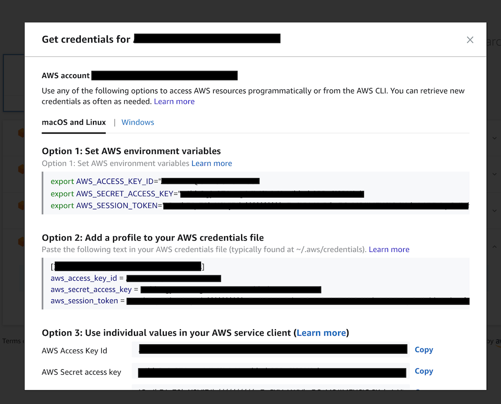

# run terraform commands using aws sso with aws cli version 2

i started using aws control tower.

curious about its features, that i believe is inspired by their infamous well architected framework.

it comes with pre-defined core accounts to form a secure cloud platform, ready to be used by software makers.

then, i was introduced to aws cli version 2 and this command, `aws sso login --profile=abc`.

this command allows me to login to my aws account and do stuff from my shell.

i can switch to different aws profiles too.

noice.

native aws cli commands is all covered.

things got sticky when i wanted to run terraform.

``` shell
$ terraform plan

Refreshing Terraform state in-memory prior to plan...
The refreshed state will be used to calculate this plan, but will not be
persisted to local or remote state storage.

Error: No valid credential sources found for AWS Provider.
 Please see https://terraform.io/docs/providers/aws/index.html for more information on
 providing credentials for the AWS Provider
```

my shell environment was not configured with the credentials. it doesn't work seamlessly. like zippers. seamless.

the official way to do this is to get the credentials using their aws sso web console.



when my token expires, i go back to the web console and get new credentials.

painful.

i want to keep my operating environment in shell.

my search brought me to this nifty project, https://github.com/linaro-its/aws2-wrap.

this useful software sets up my shell environment with aws sso credentials.

noice noice.

i fixed up alias shortcuts for my shell.

``` shell
alias aws-sso-login-abc123="aws sso login --profile=abc123"

alias aws-sso-env-abc123="eval \"$(aws2-wrap --profile abc123 --export)\""
```

noice noice noice.

when i want to work with aws account abc123, i run,

``` shell
aws-sso-login-abc123
```

it will open a web browser and prompts me to sign in to my aws account.

after i signed in, i run,

``` shell
aws-sso-env-abc123
```

this will export the credentials as environment variables.

much better workflow.
