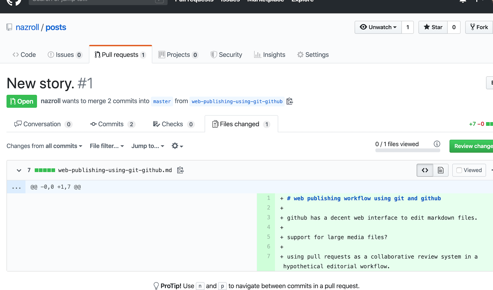
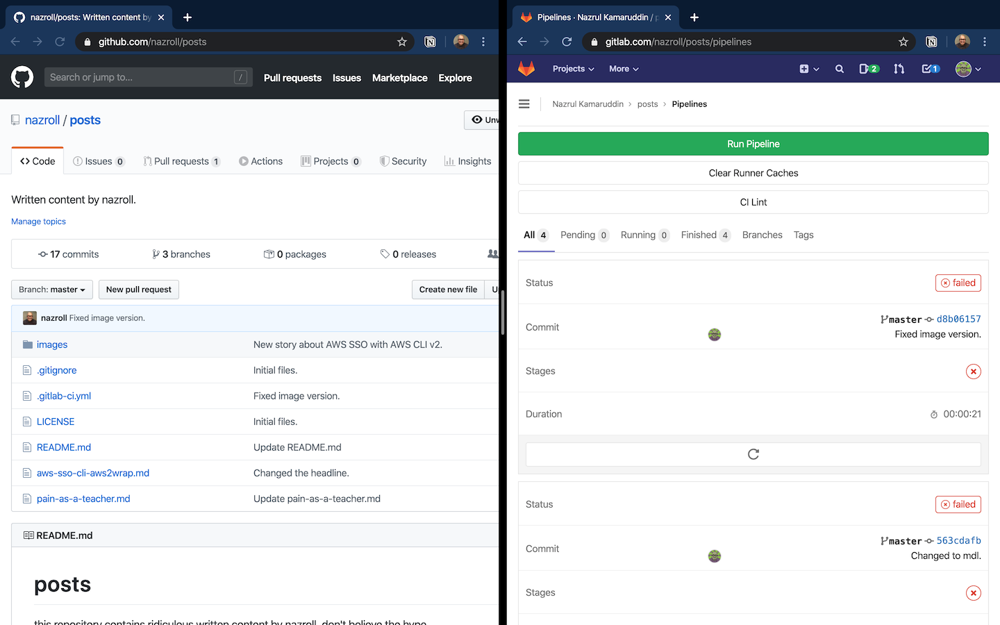

# web publishing workflow using git and github

github has a decent web interface to edit markdown files.

github has Git LFS, https://help.github.com/en/github/managing-large-files/about-git-large-file-storage.

using pull requests as a collaborative review system in a hypothetical editorial workflow.

use github actions to generate html pages and push it to a cloud object storage service.

use a cloud object storage service that supports hosting a static website.

use github desktop app to create a new branch when i have a new post idea.

git = collaboration tool.

github = repository.

gitlab ci = artefacts generator.

the idea of gitlab hosting a copy of my repository is kind of silly. 

that is my disaster recovery plan.

